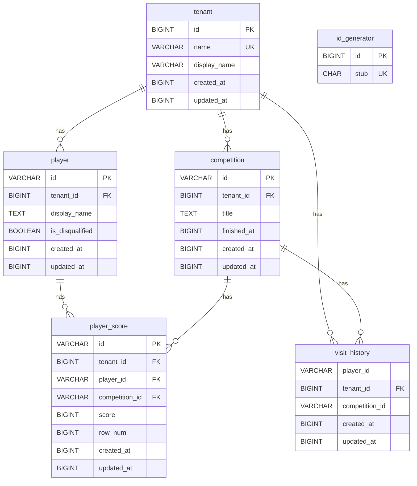

# ER図

## DB構成の補足

- `tenant`, `id_generator`, `visit_history` は **MySQL（adminDB）** で管理
- `competition`, `player`, `player_score` は **SQLite（テナントごとの個別DB）** で管理

## ER図

```mermaid
erDiagram
    tenant {
        BIGINT id PK
        VARCHAR name UK
        VARCHAR display_name
        BIGINT created_at
        BIGINT updated_at
    }

    id_generator {
        BIGINT id PK
        CHAR stub UK
    }

    visit_history {
        VARCHAR player_id
        BIGINT tenant_id FK
        VARCHAR competition_id
        BIGINT created_at
        BIGINT updated_at
    }

    competition {
        VARCHAR id PK
        BIGINT tenant_id FK
        TEXT title
        BIGINT finished_at
        BIGINT created_at
        BIGINT updated_at
    }

    player {
        VARCHAR id PK
        BIGINT tenant_id FK
        TEXT display_name
        BOOLEAN is_disqualified
        BIGINT created_at
        BIGINT updated_at
    }

    player_score {
        VARCHAR id PK
        BIGINT tenant_id FK
        VARCHAR player_id FK
        VARCHAR competition_id FK
        BIGINT score
        BIGINT row_num
        BIGINT created_at
        BIGINT updated_at
    }

    tenant ||--o{ competition : "has"
    tenant ||--o{ player : "has"
    tenant ||--o{ visit_history : "has"
    player ||--o{ player_score : "has"
    competition ||--o{ player_score : "has"
    competition ||--o{ visit_history : "has"
```
